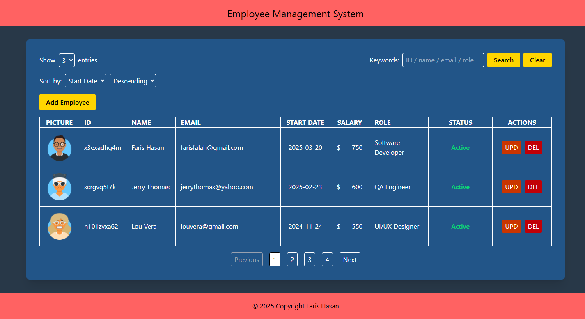
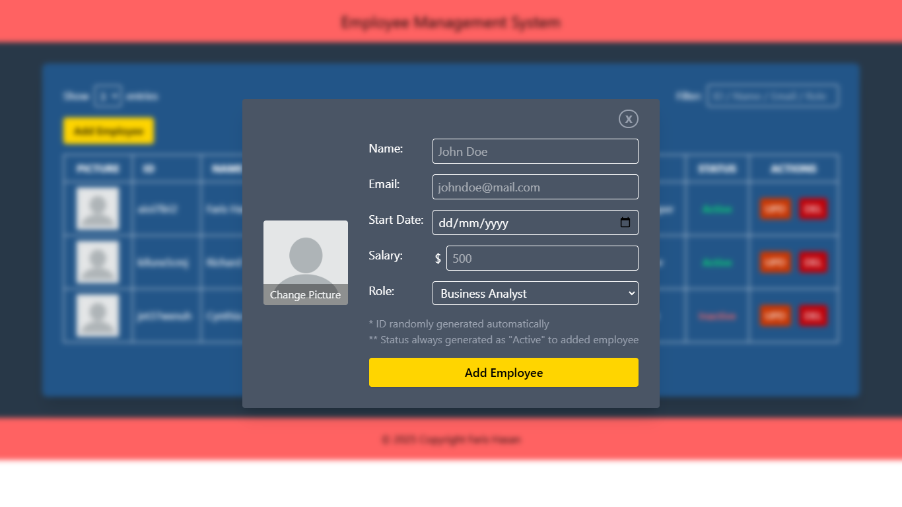

# CRUD App with html, tailwind css, & javascript

* Includes 3 files only with public folder as a container for pictures

## Features

* Render data list on a fit table
* Add, edit, and delete data
* Filtering input on multiple category
* Pagination for every 3/5/8 entries
* Upload picture and render it on table
* Responsive down to 380px in width

## Screenshots

