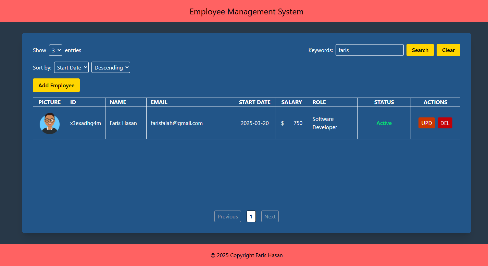

# CRUD Employee Management System (HTML, CSS, JS)

* Employee Management System client app with CRUD function using HTML5, Tailwind CSS, and JavaScript only.
* JSON-server implemented for backend mock

## Features

* User-friendly interface
* Entry selection to manage employee records efficiently
* Filter employees by ID, name, email or role to find employees quickly
* Pagination for easy navigation through employee records
* Modal display for easy access of adding employee
* Quick actions button to delete employee
* Upload picture of employees and store it to json-server (as base64)

## Getting ready

1. Make sure your device have already installed Node.js and a browser.
2. Clone this repository and open terminal inside this repo folder.
3. Run `npm i` on your terminal to install modules.
4. Rename `db.json.example` to `db.json`.
5. Run `npm start` on your terminal to start server, do not close terminal.
6. Open `index.html` file into a browser.
7. You're good to go!

## Screenshots

## [WIP] Next Features

### UI related

1. Add responsiveness by showing fewer data
2. Compensate fewer data shown by adding detail button
3. Loading animation

### CRUD related

1. Function to update data
2. Sanitise input
